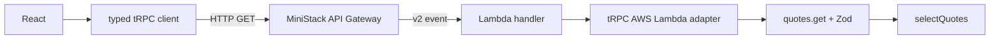

# Following a request



Responses travel back through the same layers. The adapter serializes the tRPC response; API Gateway delivers it over HTTP; the client decodes it and React Query updates the UI.

| Layer | Files | Responsibility |
| --- | --- | --- |
| Browser | `frontend/src/App.tsx`, `frontend/src/api.ts` | Theme, query/cache, Refresh, loading and errors. `AppRouter` is a type-only import. |
| Infrastructure | `compose.yaml`, `terraform/ministack/*.tf` | MiniStack listener, HTTP API routes/CORS, Lambda ZIP, runtime and invocation permission. |
| Entry adapter | `backend/src/entrypoints/lambda.ts` | Connect the HTTP API v2 event to the adapter, attach request-scoped logging, log the HTTP outcome. |
| Transport | `backend/src/trpc/init.ts`, `router.ts` | Dispatch `quotes.get`, validate input, log the procedure outcome. |
| Application | `backend/src/quotes/` | Sample three distinct quotes from the requested collection. No HTTP or AWS dependencies. |

## Trace it yourself

First build and redeploy the backend using the README commands. The new logging code must be in the deployed ZIP.

1. Run the UI, open browser developer tools → Network, filter on `quotes.get`, and click **Refresh**. Select that request rather than an initial page-load request.
2. Inspect its URL and method: `GET <api_url>/quotes.get?input=%7B%22theme%22%3A%22day%22%7D`. The decoded `input` is `{"theme":"day"}`. Inspect the JSON response: `result.data` contains three quotes. The request goes to port 4566; Vite serves assets on port 5173.
3. Follow the Terraform resources: `aws_apigatewayv2_route.api` (`ANY /{proxy+}`) targets `aws_apigatewayv2_integration.api`, which invokes `aws_lambda_function.api` (`trpc-lab-api`) with payload format 2.0. Its Lambda invocation method is POST even though the browser query is GET. `/probe` has its own more specific route and handler.
4. Copy the response header `x-lambda-request-id`. Read MiniStack's emulated CloudWatch Logs with the command below. That ID identifies the Lambda invocation. Both log entries also include the separate `gatewayRequestId` from the event; MiniStack's response `x-amzn-requestid` differed from that event ID in the observed trace.
5. Match the procedure entry (`path: "quotes.get"`, `type: "query"`, `code: "OK"`) and HTTP entry (`path: "/quotes.get"`, `statusCode: 200`). In `router.ts`, the validated theme reaches `selectQuotes(input.theme)`.

Filter on the copied request ID, using local dummy credentials:

```sh
REQUEST_ID='<x-lambda-request-id from the response>'
env -u AWS_PROFILE -u AWS_DEFAULT_PROFILE -u AWS_SESSION_TOKEN \
  AWS_ACCESS_KEY_ID=test AWS_SECRET_ACCESS_KEY=test AWS_DEFAULT_REGION=us-east-1 \
  aws --endpoint-url http://localhost:4566 logs filter-log-events \
  --log-group-name /aws/lambda/trpc-lab-api --filter-pattern "$REQUEST_ID" \
  --query 'events[].message' --output text
```

`docker compose logs -f ministack` shows emulator and worker lifecycle output, but did not show these structured `console.info` entries in the tested execution mode.

Illustrative log entries; IDs and durations vary:

```json
{"event":"trpc.procedure","requestId":"lambda-id","gatewayRequestId":"gateway-id","path":"quotes.get","type":"query","code":"OK","durationMs":0}
{"event":"lambda.response","requestId":"lambda-id","gatewayRequestId":"gateway-id","method":"GET","path":"/quotes.get","statusCode":200,"durationMs":2}
```

The request-scoped callback is created by the adapter for each invocation. The router receives an optional logging function rather than AWS event types; direct caller tests can still use `{}`. [tRPC middleware](https://trpc.io/docs/server/middlewares#logging) surrounds input validation and resolver execution. Timings are elapsed milliseconds within this process: Lambda timing includes procedure timing, so do not add them or treat them as browser/network latency. Logs record IDs and outcomes, without request headers, raw input, or quote bodies.

The header is visible in the browser Network panel. The UI does not read it through `fetch`; that would require exposing the header in API Gateway's CORS configuration.

## Validation and errors

TypeScript checks frontend code during development. The Zod `.input()` schema in `router.ts` checks actual incoming data at runtime, before quote selection.

```sh
API=$(terraform -chdir=terraform/ministack output -raw api_url)
curl -i --get "$API/quotes.get" --data-urlencode 'input={"theme":"dusk"}'
```

This returns HTTP 400 with `error.data.code: "BAD_REQUEST"`; the known procedure logs `BAD_REQUEST`. The adapter translates [tRPC errors](https://trpc.io/docs/server/error-handling) into the response status and JSON envelope. The client rejects the query, React Query sets its error state, and the UI offers Refresh while retaining any previous selection.

Malformed JSON is rejected before procedure execution; an unknown path returns `NOT_FOUND`/404 without selecting a procedure. These cases produce a `lambda.response` entry but no `trpc.procedure` entry. Unexpected exceptions escaping the adapter produce `lambda.error` and are rethrown to the runtime.

## Who owns the servers?

Vite is a persistent local development server for HTML, JavaScript, CSS and hot reload. It hosts no backend routes. MiniStack owns the listener on port 4566 and emulates API Gateway and Lambda, invoking the uploaded handler in its local Node executor.

In AWS, API Gateway accepts requests and Lambda manages Node execution environments. Our backend starts no listening HTTP server. The module-scope router and adapter may be reused across invocations, but each invocation gets its own request context and IDs. A production frontend build is static assets; hosting those assets is separate from the Lambda API. On AWS, console output goes to [CloudWatch Logs](https://docs.aws.amazon.com/lambda/latest/dg/nodejs-logging.html) when the execution role has the required logging permissions; that infrastructure remains step 9.
